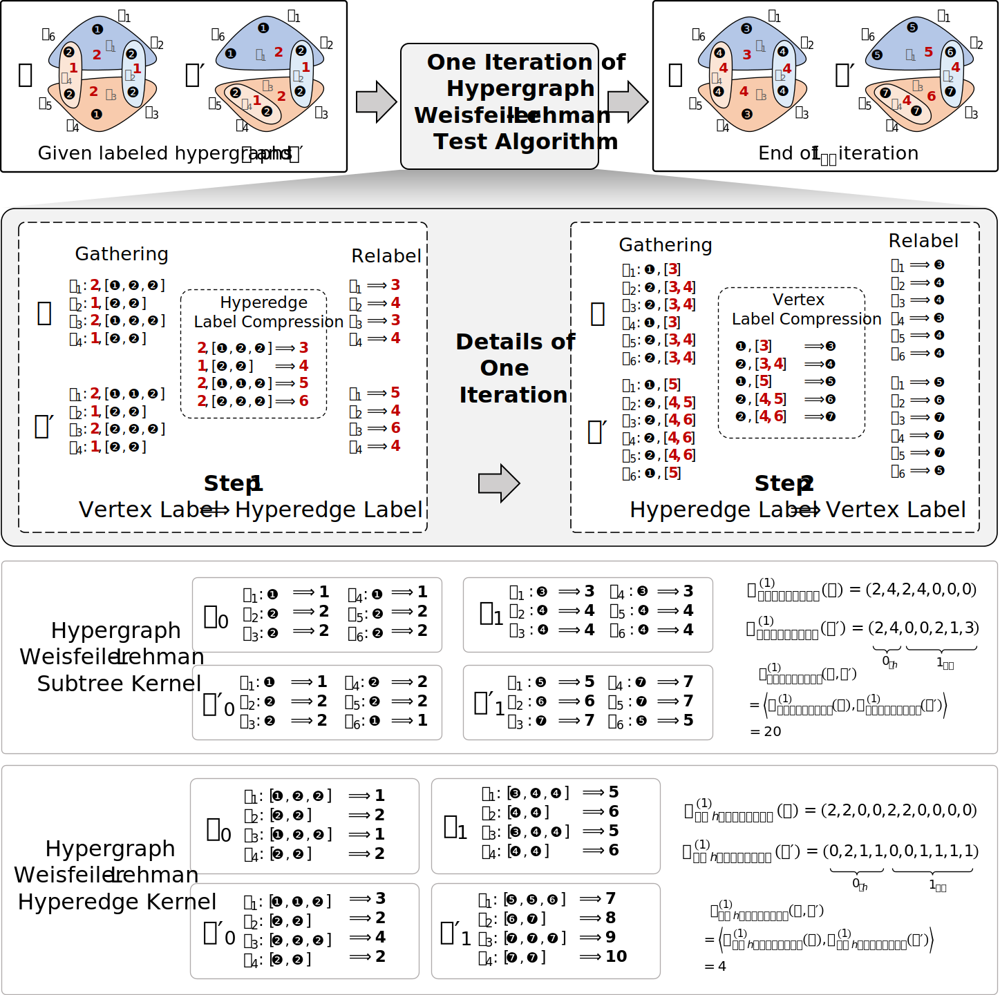

# Hypergraph Isomorphism Computation

This repository contains the code for the paper "Hypergraph Isomorphism Computation (IEEE TPAMI 2024)" by Yifan Feng, Jiashu Han, Shihui Ying, and Yue Gao*. The paper is available at [here](https://ieeexplore.ieee.org/abstract/document/10398457/).



<!-- ## Abstract
The isomorphism problem is a fundamental problem in network analysis, which involves capturing both low-order and high-order structural information. In terms of extracting low-order structural information, graph isomorphism algorithms analyze the structural equivalence to reduce the solver space dimension, which demonstrates its power in many applications, such as protein design, chemical pathways, and community detection. For the more commonly occurring high-order relationships in real-life scenarios, the problem of hypergraph isomorphism, which effectively captures these high-order structural relationships, cannot be straightforwardly addressed using graph isomorphism methods. Besides, the existing hypergraph kernel methods may suffer from high memory consumption or inaccurate sub-structure identification, thus yielding sub-optimal performance. In this paper, to address the abovementioned problems, we first propose the hypergraph Weisfiler-Lehman test algorithm for the hypergraph isomorphism test problem by generalizing the Weisfiler-Lehman test algorithm from graphs to hypergraphs. Secondly, based on the presented algorithm, we propose a general hypergraph Weisfieler-Lehman kernel framework and implement two instances, which are Hypergraph Weisfeiler-Lehamn Subtree Kernel (Hypergraph WL Subtree Kernel) and Hypergraph Weisfeiler-Lehamn Hyperedge Kernel (Hypergraph WL Hyperedge Kernel). The Hypergraph WL Subtree Kernel counts different types of rooted subtrees and generates the final feature vector for a given hypergraph by comparing the number of different types of rooted subtrees. The Hypergraph WL Hyperedge Kernel is developed to process hypergraphs with more degrees of hyperedges, which counts the vertex labels that are connected by each hyperedge to generate the feature vector. Mathematically, we prove the proposed Hypergraph WL Subtree Kernel can degenerate into the typical Graph Weisfeiler-Lehman Subtree Kernel when dealing with low-order graph structures. In order to fulfill our research objectives, a comprehensive set of experiments was meticulously designed , including seven graph classification datasets and 12 hypergraph classification datasets. Results on graph classification datasets indicate that the Hypergraph WL Subtree Kernel can achieve the same performance compared with the classical Graph Weisfeiler-Lehman Subtree Kernel. Results on hypergraph classification datasets show significant improvements compared to other typical kernel-based methods, which demonstrates the effectiveness of the proposed methods. In our evaluation, we found that our proposed methods outperform the second-best method in terms of runtime, running over 80 times faster when handling complex hypergraph structures. This significant speed advantage highlights the great potential of our methods in real-world applications. -->

## Introduction
In this repository, we provide our implementation of Hypergraph WL Subtree Kernel, Hypergraph WL Hyperedge Kernel and some compared methods including Graph Subtree Kernel, Graphlet Kernel, Hypergraph Directed Line Kernel, and Hypergraph Rooted Kernel. The implementation is based on the following libraries:
* [python 3.9](https://www.python.org/): basic programming language.
* [dhg 0.9.3](https://github.com/iMoonLab/DeepHypergraph): for hypergraph representation and learning. 
* [torch 1.12.1](https://pytorch.org/): for computation.
* [hydra-core 1.3.2](https://hydra.cc/docs/intro/): for configuration and multi-run management.
* [scikit-multilearn 0.2.0](http://scikit.ml/): for multi-label learning.

## Installation
1. Clone this repository.
2. Install the required libraries.
``` bash
pip install -r requirements.txt
```

## Usage
Modify the `root` path in `ml_config.yaml` to the absolute path of the `data` folder in this repository. Then, run the following command to reproduce the results in the paper:
``` bash
python ml_main.py
```

You can change the name of `model` and `dataset` in `ml_config.yaml` to reproduce the results of other models and datasets. All available models and datasets are listed in the following:

**Models**
- `graphlet_sampling`: [Efficient
graphlet kernels for large graph comparison. PMLR 2009](https://proceedings.mlr.press/v5/shervashidze09a/shervashidze09a.pdf).
- `graph_subtree`: [Fast subtree kernels on graphs. NIPS 2009](https://is.mpg.de/fileadmin/user_upload/files/publications/NIPS2009-Shervashidze_6080[0].pdf).
- `hypergraph_rooted`: [Learning from interpretations: a rooted
kernel for ordered hypergraphs. ICML 2007](https://icml.cc/imls/conferences/2007/proceedings/papers/467.pdf).
- `hypergraph_directed_line`: [A Hypergraph Kernel from Isomorphism Tests. ICPR 2014](https://ieeexplore.ieee.org/document/6977378).
- `hypergraph_subtree`: The proposed method.
- `hypergraph_hyedge`: The proposed method.

**Datasets**
- Graph Classification Datasets: `RG_macro`, `RG_sub`, `IMDBBINARY`, `IMDBMULTI`, `MUTAG`, `NCI1`, `PROTEINS`
- Hypergraph Classification Datasets: `RHG_3`, `RHG_10`, `RHG_table`, `RHG_pyramid`, `IMDB_dir_form`, `IMDB_dir_genre`, `IMDB_wri_form`, `IMDB_wri_genre`, `IMDB_dir_genre_m`, `IMDB_wri_genre_m`, `stream_player`, `twitter_friend`

## Citation
If you find this repository useful in your research, please cite our following papers:
```
@article{feng2024hypergraph,
  title={Hypergraph Isomorphism Computation},
  author={Feng, Yifan and Han, Jiashu and Ying, Shihui and Gao, Yue},
  journal={IEEE Transactions on Pattern Analysis and Machine Intelligence},
  year={2024},
  publisher={IEEE}
}

@article{gao2022hgnn+,
  title={HGNN+: General hypergraph neural networks},
  author={Gao, Yue and Feng, Yifan and Ji, Shuyi and Ji, Rongrong},
  journal={IEEE Transactions on Pattern Analysis and Machine Intelligence},
  volume={45},
  number={3},
  pages={3181--3199},
  year={2022},
  publisher={IEEE}
}
```